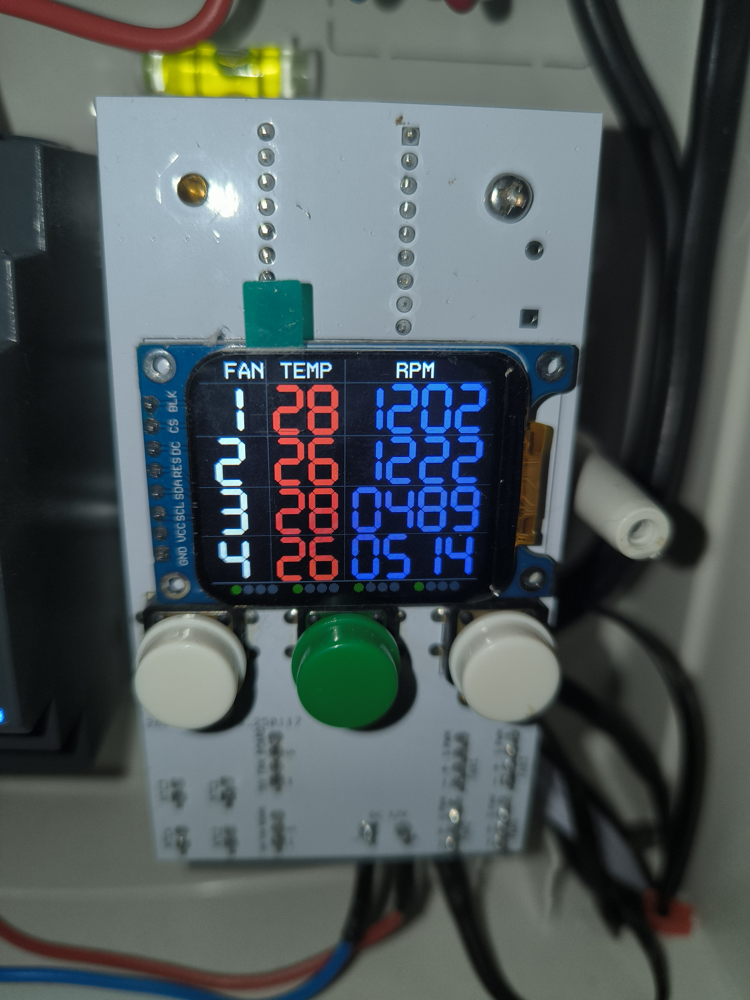

[English](README.md) | Українська



# Плата керування обертами вентиляторів (PWM)

Плата для керування обертами вентиляторів за допомогою ШІМ (широтно-імпульсної модуляції).

## Огляд

Плата призначена для керування до чотирьох вентиляторів на основі показників до чотирьох температурних датчиків NTC.  
Зокрема, вона розроблена для роботи з гібридними інверторами та містить режим емуляції вентиляторів інвертора.

- Загальний вихідний струм: до **5 А**, що з великим запасом достатньо для типових вентиляторів
- Тип датчика температури: **NTC 10 кΩ**
- Підтримується до **4 вентиляторів**
- Підтримується до **4 датчиків температури**
- **4 ступені швидкості** вентиляторів залежно від температури
- **1 додаткова швидкість за замовчуванням** (коли температура нижча за перший ступінь)

## Взаємозв’язок вентиляторів і датчиків

Логіка керування налаштовується в меню:

- Будь-який датчик може керувати будь-яким вентилятором або групою вентиляторів
- Допускаються всі комбінації

Приклади:

- Один датчик керує всіма 4-ма вентиляторами
- Два датчики:  
  - Перший датчик керує вентиляторами 1–2  
  - Другий датчик керує вентиляторами 3–4
- Один датчик керує одним вентилятором, інший – рештою трьома тощо

У головному меню відображається для кожного вентилятора/датчика:

- Температура
- Оберти вентилятора (RPM)
- Поточна швидкість (ступінь)

## Інтеграція з гібридним інвертором

Плата розроблена для роботи разом з гібридним інвертором і підтримує **режим емуляції вентилятора інвертора**.

- Якщо в налаштуваннях допускається зупинка вентиляторів (зверніть увагу: не всі вентилятори підтримують повну зупинку),
  інвертор **не** сформує помилку «вентилятор зупинений».
- Емуляція реалізована подачею імпульсів частотою **300 Гц** на сигнальний (жовтий) контакт роз’єму вентилятора,
  до якого мав би підключатися штатний вентилятор інвертора.

Ця частота відповідає **9000 об/хв** вентилятора:

- 2 імпульси на один оберт  
- Формула: `300 / 2 * 60 = 9000`

### Обробка помилок вентилятора

Якщо налаштовано, що вентилятор має обертатися, але з якоїсь причини цього не відбувається (наприклад):

- роз’єм не підключений,
- вентилятор заблокований стороннім предметом,
- вентилятор несправний,

то в інверторі виникає помилка, і він вимикається до усунення причини.  
Це зроблено навмисно для запобігання перегріву інвертора.

## Прошивка та розробка

### Команда для прошивки

```bash
cargo flash --chip stm32f411ceu6 --release
```

### Компіляція з активним терміналом (видимий вивід повідомлень)

```bash
cargo run --release
```

### Компіляція з від’єднанням терміналу

```bash
cargo embed --release
```

### Конвертація у HEX-файл

```bash
cargo-objcopy target/thumbv7em-none-eabihf/release/two --release -- -O ihex two.hex
```

### Дизасемблювання

```bash
cargo objdump --bin two --release -- --disassemble --no-show-raw-insn --print-imm-hex
```

### Запуск OpenOCD

```bash
openocd -f interface/stlink.cfg -f target/stm32f4x.cfg
```

### Перегляд розміру програми

```bash
cargo size --bin fan_controller --release -- -A
```

## Розміщення в пам’яті

### Пам’ять програми (Flash, початкова адреса: `0x08000000`)

- `.vector_table` – таблиця векторів переривань, зазвичай розташована на початку пам’яті, містить адреси обробників переривань
- `.text` – секція з машинним кодом програми (інструкції)
- `.rodata` – секція для константних даних (тільки для читання)

### Оперативна пам’ять (RAM, початкова адреса: `0x20000000`)

- `.data` – глобальні та статичні змінні, ініціалізовані певними значеннями
- `.bss` – глобальні та статичні змінні, ініціалізовані нулями
- `.uninit` – змінні, які не ініціалізуються під час запуску програми

### Секції, що не є критичними для виконання програми

- `.gnu.sgstubs` – може містити спеціальні заглушки, специфічні для GNU
- `.ARM.attributes` – атрибути, специфічні для архітектури ARM
- `.comment` – коментарі або метадані
- `.defmt` – дані для форматування виводу (наприклад, для бібліотеки `defmt`)